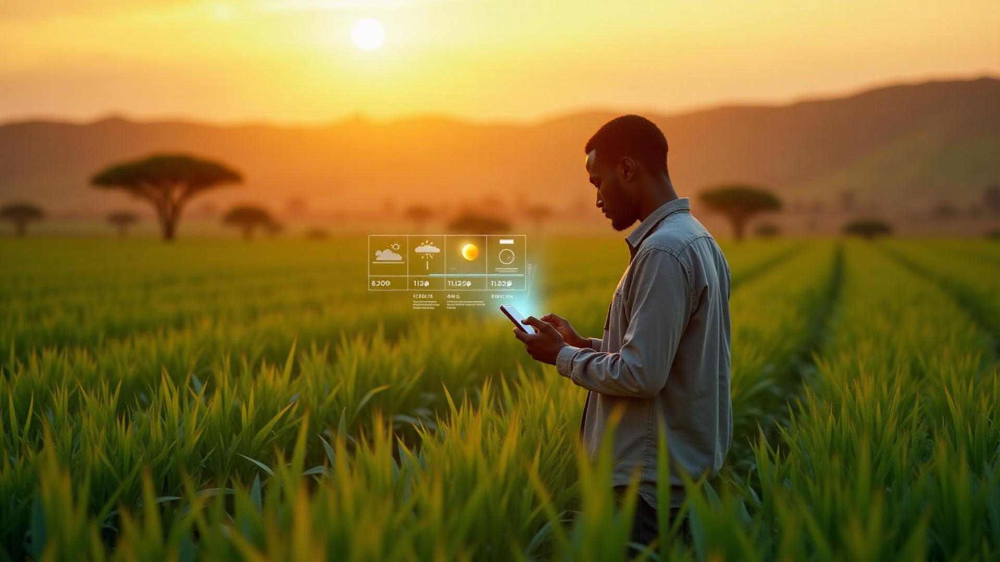

# AgriGuard - Smart Harvest 🌾🤖



**AI-Powered Early Warnings for a Food-Secure Kenya**

AgriGuard is a multi-agent AI platform designed to empower farmers, cooperatives, and government agencies with predictive analytics. By leveraging Google's Gemini AI and real-time data, AgriGuard provides actionable insights to prevent post-harvest losses and ensure climate-resilient decision-making.

---

## 🚀 Key Features

### 1. Multi-Agent AI System
AgriGuard employs specialized AI agents to monitor different aspects of the agricultural lifecycle:

* **🌦️ Climate Risk Agent:** Analyzes weather patterns to predict floods, droughts, and rainfall risks over 48-hour to 14-day windows.
* **🌱 Crop Health Agent:** Uses image analysis to detect pests and diseases, providing immediate treatment recommendations and confidence scores.
* **Ql Market Intelligence Agent:** Monitors commodity prices (Maize, Wheat, Rice) across major Kenyan markets (Nairobi, Nakuru, Mombasa) to recommend the best selling times.

### 2. Real-Time Dashboard
* **Interactive Climate Map:** Visualizes risk levels across regions (High/Medium/Low).
* **Live Alerts Feed:** Critical warnings regarding weather events, pest outbreaks, and market price surges.
* **Agent Status:** Monitor the activity and last update times of all AI agents.

---

## 🛠️ Tech Stack

**Frontend:**
* [React](https://react.dev/) (TypeScript)
* [Vite](https://vitejs.dev/) - Build tool
* [Tailwind CSS](https://tailwindcss.com/) - Styling
* [shadcn/ui](https://ui.shadcn.com/) - UI Components
* [Recharts](https://recharts.org/) - Data Visualization
* [Lucide React](https://lucide.dev/) - Icons

**Backend & AI:**
* [Supabase](https://supabase.com/) - Database (PostgreSQL), Auth, & Realtime subscriptions.
* [Supabase Edge Functions](https://supabase.com/docs/guides/functions) - Serverless compute for AI agents.
* [Google Gemini AI](https://deepmind.google/technologies/gemini/) - Large Language Model powering the analysis.
* [Lovable](https://lovable.dev/) - accelerated development platform.

---

## ⚙️ Getting Started

### Prerequisites
* Node.js (v18+ recommended)
* npm or bun
* A [Supabase](https://supabase.com/) project

### Installation

1.  **Clone the repository**
    ```bash
    git clone [https://github.com/nicholasgodwin34/agriguard-smart-harvest.git](https://github.com/nicholasgodwin34/agriguard-smart-harvest.git)
    cd agriguard-smart-harvest
    ```

2.  **Install dependencies**
    ```bash
    npm install
    # or
    bun install
    ```

3.  **Environment Setup**
    Create a `.env` file in the root directory based on the provided example. You will need your Supabase credentials.
    ```env
    VITE_SUPABASE_URL=your_supabase_project_url
    VITE_SUPABASE_PUBLISHABLE_KEY=your_supabase_anon_key
    ```

4.  **Database Setup**
    Run the SQL migration file located at `supabase/migrations/20251118085200_987cc14c-67b1-44cf-9e9a-c944f1770e94.sql` in your Supabase SQL Editor. This will:
    * Create tables: `agent_predictions`, `alerts`, `climate_data`, `crop_health`, `market_prices`.
    * Enable Row Level Security (RLS).
    * Insert initial mock data for demonstration.

5.  **Run the Application**
    ```bash
    npm run dev
    ```
    Open [http://localhost:8080](http://localhost:8080) in your browser.

---

## 🧠 AI Agent Configuration

The logic for the AI agents resides in `supabase/functions/`. To deploy these functions to Supabase:

1.  Ensure you have the Supabase CLI installed and logged in.
2.  Set your secrets (specifically `LOVABLE_API_KEY` or your Gemini API Key) in Supabase.
3.  Deploy functions:
    ```bash
    supabase functions deploy climate-agent
    supabase functions deploy crop-health-agent
    supabase functions deploy market-intelligence-agent
    ```

---

## 📂 Project Structure

````

src/
├── components/        \# React components
│   ├── ui/            \# Reusable shadcn/ui components
│   ├── AgentDashboard.tsx \# Main agent status view
│   ├── AlertsFeed.tsx     \# Real-time alert list
│   └── ClimateRiskMap.tsx \# Climate visualization
├── hooks/             \# Custom React hooks
├── integrations/      \# Supabase client configuration
├── pages/             \# Route pages (Index, NotFound)
└── assets/            \# Static assets (images)

supabase/
├── functions/         \# Deno Edge Functions (The AI Brains)
│   ├── climate-agent
│   ├── crop-health-agent
│   └── market-intelligence-agent
└── migrations/        \# SQL Database schema

```

---

## 🤝 Contributing

Contributions to improve food security technology are welcome!

1.  Fork the Project
2.  Create your Feature Branch (`git checkout -b feature/AmazingFeature`)
3.  Commit your Changes (`git commit -m 'Add some AmazingFeature'`)
4.  Push to the Branch (`git push origin feature/AmazingFeature`)
5.  Open a Pull Request

---

## 📄 License

Distributed under the MIT License. See `LICENSE` for more information.
